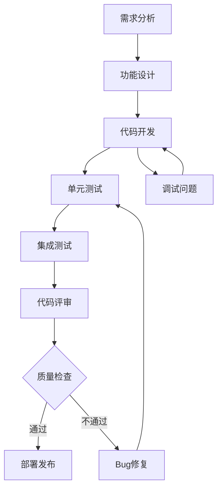

# Cursor 规则使用指南

## 📋 规则文件总览

| 规则文件 | 使用场景 | 触发方式 | 状态 |
|---------|---------|---------|------|
| `generate-rules.mdc` | 通用代码生成和开发 | 默认规则 | ✅ 完整 |
| `requirements-rules.mdc` | 需求分析 | 以"需求"开头 | ✅ 完整 |
| `design/design-rules.mdc` | 功能特性设计 | 以"design"开头 | ✅ 完整 |
| `design/design-spec-rules.mdc` | 详细设计规范 | 设计流程详细版 | ✅ 完整 |
| `develop/develop-rules.mdc` | 开发流程指导 | 以"dev"开头 | ✅ 完整 |
| `develop/develop-spec-rules.mdc` | 开发详细规范 | 开发流程详细版 | ✅ 完整 |
| `bugfix-rules.mdc` | Bug修复流程 | 手动应用 | ✅ 完整 |
| `debug-rules.mdc` | 调试指导 | 手动应用 | ✅ 完整 |
| `review-rules.mdc` | 代码评审 | 手动应用 | ✅ 完整 |
| `testing-rules.mdc` | 测试流程 | 手动应用 | ✅ 完整 |
| `deployment-rules.mdc` | 部署发布流程 | 手动应用 | ✅ 新增 |
| `maintenance-rules.mdc` | 维护优化 | 手动应用 | ✅ 新增 |
| `performance-rules.mdc` | 性能优化 | 手动应用 | ✅ 新增 |

## 🎯 使用场景指南

### 1. 需求分析阶段
- **目标**：将原始需求转换为可执行的设计方案
- **使用规则**：`requirements-rules.mdc`
- **触发方式**：以"需求"或"requirements"开头
- **示例**：`需求分析用户登录系统`

### 2. 功能设计阶段
- **目标**：设计具体功能的详细方案
- **使用规则**：`design/design-rules.mdc`
- **触发方式**：消息以"design"开头
- **示例**：`design 用户登录功能`

### 3. 代码开发阶段
- **目标**：基于设计文档进行代码实现
- **使用规则**：`develop/develop-rules.mdc`
- **触发方式**：消息以"dev"开头
- **示例**：`dev 实现用户登录功能`

### 4. 问题调试阶段
- **目标**：系统化定位和解决代码问题
- **使用规则**：`debug-rules.mdc`
- **触发方式**：手动指定或包含"debug"、"调试"关键词
- **示例**：`debug 登录功能报错问题`

### 5. Bug修复阶段
- **目标**：规范化的Bug修复流程
- **使用规则**：`bugfix-rules.mdc`
- **触发方式**：手动指定或包含"bugfix"、"修复"关键词
- **示例**：`修复用户登录失败的问题`

### 6. 代码评审阶段
- **目标**：全面的代码质量评审
- **使用规则**：`review-rules.mdc`
- **触发方式**：手动指定或包含"review"、"评审"关键词
- **示例**：`review 用户登录模块代码`

### 7. 测试阶段
- **目标**：系统化的测试策略和执行
- **使用规则**：`testing-rules.mdc`
- **触发方式**：手动指定或包含"test"、"测试"关键词
- **示例**：`测试用户登录功能`

### 8. 部署发布阶段
- **目标**：安全可靠的系统部署和发布
- **使用规则**：`deployment-rules.mdc`
- **触发方式**：手动指定或包含"deploy"、"部署"、"发布"关键词
- **示例**：`部署用户管理系统到生产环境`

### 9. 维护优化阶段
- **目标**：系统的持续维护和优化
- **使用规则**：`maintenance-rules.mdc`
- **触发方式**：手动指定或包含"维护"、"优化"关键词
- **示例**：`维护优化用户系统性能`

### 10. 性能优化阶段
- **目标**：系统性能分析和优化
- **使用规则**：`performance-rules.mdc`
- **触发方式**：手动指定或包含"性能"、"performance"关键词
- **示例**：`性能优化数据库查询`

### 11. 通用开发
- **目标**：日常代码生成和开发指导
- **使用规则**：`generate-rules.mdc`
- **触发方式**：默认规则（无特定前缀时）
- **示例**：`创建一个Vue组件`

## 🔄 完整研发流程

## 📚 规则文件说明

### 核心规则文件
- **generate-rules.mdc**：项目的核心开发规范，包含目录结构、代码规范、测试要求等
- **requirements-rules.mdc**：5步需求分析流程，从需求收集到基线化
- **design-rules.mdc**：功能设计的简化流程框架，配合 design-spec-rules.mdc 使用
- **develop-rules.mdc**：开发流程的简化框架，配合 develop-spec-rules.mdc 使用

### 专项规则文件
- **bugfix-rules.mdc**：5步Bug修复流程，从问题复现到文档记录
- **debug-rules.mdc**：4步调试流程，系统化的问题定位方法
- **review-rules.mdc**：6维度代码评审框架，全面的质量检查
- **testing-rules.mdc**：5层测试策略，从单元测试到验收测试

## 🚨 注意事项

### 规则触发优先级
1. **明确指定的规则**（最高优先级）
2. **关键词匹配的规则**
3. **前缀触发的规则**
4. **默认规则**（generate-rules.mdc）

### 规则组合使用
- 需求阶段可能需要同时参考 requirements-rules 和 generate-rules
- 设计阶段可能需要同时参考 design-rules 和 generate-rules
- 开发阶段需要同时遵循 develop-rules 和 generate-rules
- 测试阶段需要结合 testing-rules 和具体的测试规范

### 缺失的规则
目前规则体系已经完整，涵盖了完整的软件开发生命周期：
- ✅ 需求分析：`requirements-rules.mdc`
- ✅ 功能设计：`design/design-rules.mdc`
- ✅ 代码开发：`develop/develop-rules.mdc`
- ✅ Bug修复：`bugfix-rules.mdc`
- ✅ 问题调试：`debug-rules.mdc`
- ✅ 代码评审：`review-rules.mdc`
- ✅ 软件测试：`testing-rules.mdc`
- ✅ 部署发布：`deployment-rules.mdc`
- ✅ 维护优化：`maintenance-rules.mdc`
- ✅ 性能优化：`performance-rules.mdc`
- ✅ 通用开发：`generate-rules.mdc`

## 💡 最佳实践建议

1. **明确触发**：在消息开头明确指定要使用的规则类型
2. **上下文说明**：提供足够的上下文信息帮助选择合适的规则
3. **流程衔接**：注意不同阶段规则之间的衔接和一致性
4. **质量控制**：每个阶段都要进行相应的质量检查
5. **文档同步**：及时更新相关的设计和开发文档

🎯 **目标**：通过规范化的规则应用，确保研发流程的高效执行和质量保证！ 