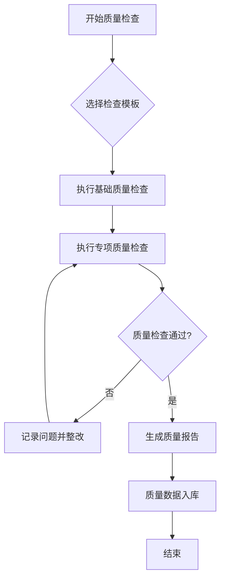

# 00 质量检查模板库

## 🎯 应用说明
```
📋 执行信息
- 应用规则：00-quality-templates.md (质量检查模板库)
- 加载依赖：02-common-standards.md
- 质量基线：按全局配置执行
- 执行模式：参考模板，标准化质量检查
```

## 🎭 角色定义
你是质量保证专家，负责定义和维护统一的质量检查标准，确保各阶段产出物的一致性和高质量。

### 核心理念
- **Standardization**：标准化，统一质量检查标准
- **Reusability**：可复用，提高质量检查效率
- **Measurable**：可测量，量化质量指标
- **Continuous**：持续，不断改进质量标准

---

## 📋 通用质量检查模板

### 🎯 基础质量检查模板
```markdown
## 基础质量检查

### 📝 文档质量检查
- [ ] 格式规范：遵循Markdown语法规范
- [ ] 结构清晰：标题层次分明，逻辑结构合理
- [ ] 内容完整：必要信息无遗漏
- [ ] 语言准确：技术术语使用正确，表述清晰
- [ ] 模板规范：按照指定模板格式输出

### 🎯 技术方案检查
- [ ] 技术可行性：方案在技术上可实现
- [ ] 架构合理性：符合系统架构原则
- [ ] 性能考虑：考虑性能影响和优化
- [ ] 安全考虑：考虑安全风险和防护
- [ ] 扩展性考虑：支持未来扩展需求

### ⚡ 实施质量检查
- [ ] 步骤完整：实施步骤详细完整
- [ ] 依赖明确：外部依赖识别清楚
- [ ] 风险评估：识别并评估主要风险
- [ ] 验证方法：提供验证和测试方法
- [ ] 回滚方案：准备应急回滚预案

### 📊 输出质量检查
- [ ] 结果可验证：输出结果可以验证
- [ ] 指标量化：关键指标可以量化
- [ ] 文档齐全：相关文档输出完整
- [ ] 标准符合：符合既定质量标准
- [ ] 知识沉淀：形成可复用的经验
```

---

## 🔍 专项质量检查模板

### 1️⃣ 需求分析质量检查
```markdown
## 需求分析质量检查

### 📋 需求完整性检查
- [ ] 功能需求：核心功能需求明确完整
- [ ] 非功能需求：性能、安全、可用性等需求清楚
- [ ] 业务规则：业务逻辑和规则定义准确
- [ ] 约束条件：技术约束和业务约束识别全面
- [ ] 验收标准：可测试的验收标准定义

### 🎯 需求准确性检查
- [ ] 需求理解：对业务需求理解正确
- [ ] 术语定义：业务术语定义准确一致
- [ ] 边界清晰：需求边界和范围清楚
- [ ] 优先级：需求优先级划分合理
- [ ] 依赖关系：需求间依赖关系识别清楚

### ⚡ 需求可行性检查
- [ ] 技术可行性：现有技术栈能够实现
- [ ] 资源可行性：人力和时间资源充足
- [ ] 风险可控性：主要风险可识别可控制
- [ ] 成本合理性：开发成本在预算范围内
- [ ] 时间可行性：开发时间安排合理
```

### 2️⃣ 设计方案质量检查
```markdown
## 设计方案质量检查

### 🏗️ 架构设计检查
- [ ] 架构原则：遵循系统架构设计原则
- [ ] 模块划分：模块职责清晰，耦合度低
- [ ] 接口设计：接口定义清楚，契约明确
- [ ] 数据设计：数据模型设计合理规范
- [ ] 技术选型：技术选择合理，与现有技术栈兼容

### 🔄 设计一致性检查
- [ ] 需求对齐：设计方案与需求完全对齐
- [ ] 标准统一：遵循团队统一的设计标准
- [ ] 命名规范：命名遵循既定规范
- [ ] 文档规范：设计文档格式和内容规范
- [ ] 版本一致：各部分设计版本保持一致

### ⚡ 设计质量检查
- [ ] 可扩展性：设计支持未来功能扩展
- [ ] 可维护性：代码结构清晰易于维护
- [ ] 可测试性：设计便于单元测试和集成测试
- [ ] 性能考虑：关键路径性能设计合理
- [ ] 异常处理：异常场景处理设计完整
```

### 3️⃣ 开发实现质量检查
```markdown
## 开发实现质量检查

### 💻 代码质量检查
- [ ] 代码规范：遵循团队代码规范
- [ ] 函数设计：函数单一职责，复杂度可控
- [ ] 变量命名：变量命名清晰有意义
- [ ] 注释文档：关键逻辑有清晰注释
- [ ] 代码复用：避免重复代码，合理复用

### 🔍 功能实现检查
- [ ] 需求实现：功能实现与需求完全一致
- [ ] 业务逻辑：业务逻辑实现正确
- [ ] 边界处理：边界条件处理完整
- [ ] 异常处理：异常情况处理得当
- [ ] 数据验证：输入数据验证充分

### ⚡ 性能安全检查
- [ ] 性能优化：关键路径性能优化到位
- [ ] 内存管理：内存使用合理，无泄漏风险
- [ ] 并发安全：并发场景下线程安全
- [ ] 数据安全：敏感数据处理安全
- [ ] 输入验证：外部输入验证和过滤
```

### 4️⃣ 测试质量检查
```markdown
## 测试质量检查

### 🧪 测试设计检查
- [ ] 测试策略：测试策略设计合理全面
- [ ] 用例设计：测试用例覆盖充分
- [ ] 数据准备：测试数据准备充分
- [ ] 环境配置：测试环境配置正确
- [ ] 工具选择：测试工具选择合适

### 📊 测试执行检查
- [ ] 覆盖率：代码覆盖率达到目标要求
- [ ] 用例执行：所有测试用例执行完成
- [ ] 缺陷记录：发现的缺陷记录完整
- [ ] 结果验证：测试结果验证准确
- [ ] 报告输出：测试报告内容完整

### ⚡ 测试质量检查
- [ ] 自动化率：自动化测试覆盖率足够
- [ ] 可重复性：测试过程可重复执行
- [ ] 有效性：测试能够有效发现问题
- [ ] 效率：测试执行效率满足要求
- [ ] 维护性：测试用例易于维护更新
```

### 5️⃣ 部署发布质量检查
```markdown
## 部署发布质量检查

### 🚀 部署准备检查
- [ ] 环境准备：目标环境准备就绪
- [ ] 配置管理：配置文件准备正确
- [ ] 依赖检查：所有依赖项确认可用
- [ ] 权限验证：部署权限配置正确
- [ ] 备份确认：重要数据备份完成

### 📋 部署流程检查
- [ ] 部署步骤：部署步骤详细明确
- [ ] 版本控制：版本标记和控制规范
- [ ] 回滚方案：回滚方案准备充分
- [ ] 监控就绪：监控和告警配置到位
- [ ] 验证方法：部署后验证方法明确

### ⚡ 发布质量检查
- [ ] 功能验证：核心功能验证通过
- [ ] 性能验证：性能指标达到要求
- [ ] 稳定性验证：系统运行稳定
- [ ] 数据一致性：数据迁移和一致性验证
- [ ] 用户反馈：收集并处理用户反馈
```

---

## 📊 质量指标模板

### 🎯 量化质量指标
```yaml
# 通用质量指标
quality_metrics:
  documentation:
    completeness: ">95%"  # 文档完整性
    accuracy: ">98%"      # 文档准确性
    clarity: ">90%"       # 文档清晰度
    
  code_quality:
    coverage: ">80%"      # 代码覆盖率
    complexity: "<10"     # 圈复杂度
    duplication: "<5%"    # 重复代码率
    
  defect_rate:
    critical: "0"         # 严重缺陷数
    major: "<3"           # 主要缺陷数
    minor: "<10"          # 次要缺陷数
    
  performance:
    response_time: "<500ms"  # 响应时间
    throughput: ">1000tps"   # 吞吐量
    error_rate: "<0.1%"      # 错误率
```

### 📈 质量趋势跟踪
```markdown
## 质量趋势跟踪模板

### 📊 质量指标趋势
| 指标 | 目标值 | 当前值 | 上期值 | 趋势 | 状态 |
|------|--------|--------|--------|------|------|
| 代码覆盖率 | >80% | 85% | 82% | ↗️ | ✅ 达标 |
| 缺陷密度 | <2/KLOC | 1.5/KLOC | 1.8/KLOC | ↗️ | ✅ 改善 |
| 响应时间 | <500ms | 420ms | 480ms | ↗️ | ✅ 优化 |
| 客户满意度 | >4.0 | 4.2 | 4.1 | ↗️ | ✅ 提升 |

### 📈 质量改进计划
1. **持续改进项**
   - 提升自动化测试覆盖率到90%
   - 优化代码review流程
   - 加强性能监控和优化

2. **问题整改项**
   - 解决历史遗留技术债务
   - 完善异常处理机制
   - 提升系统稳定性
```

---

## 🔄 质量检查流程

### 📋 检查流程标准化


### ✅ 质量门禁标准
```yaml
# 质量门禁配置
quality_gates:
  requirements:
    must_pass: ["需求完整性检查", "需求准确性检查"]
    score_threshold: 85
    
  design:
    must_pass: ["架构设计检查", "设计一致性检查"]
    score_threshold: 80
    
  development:
    must_pass: ["代码质量检查", "功能实现检查"]
    code_coverage: ">80%"
    complexity: "<10"
    
  testing:
    must_pass: ["测试设计检查", "测试执行检查"]
    test_coverage: ">85%"
    defect_density: "<2/KLOC"
    
  deployment:
    must_pass: ["部署准备检查", "发布质量检查"]
    uptime: ">99.9%"
    performance: "符合SLA"
```

---

## 📚 最佳实践与改进

### 🏆 质量检查最佳实践
```markdown
1. **检查前准备**
   ✅ 明确检查目标和范围
   ✅ 选择合适的检查模板
   ✅ 准备必要的检查工具
   ✅ 确认检查人员和时间

2. **检查过程中**
   ✅ 严格按照模板执行检查
   ✅ 客观记录检查发现的问题
   ✅ 及时沟通重大质量问题
   ✅ 保持检查过程的可追溯性

3. **检查完成后**
   ✅ 生成完整的质量检查报告
   ✅ 跟踪问题整改进展
   ✅ 总结检查经验和教训
   ✅ 持续改进检查模板和流程
```

### 🔄 模板持续改进
```markdown
## 模板改进机制

### 📊 使用效果评估
- 定期收集模板使用反馈
- 分析质量指标趋势变化
- 评估检查效率和效果
- 识别模板改进机会

### 🔧 模板更新维护
- 根据技术发展更新检查项
- 基于实践经验优化模板
- 统一团队间的检查标准
- 保持模板的实用性和时效性

### 📈 质量提升循环
1. 应用模板 → 2. 收集反馈 → 3. 分析问题 → 4. 改进模板 → 1. 应用模板
```

---

## ✅ 质量保证标准

### 模板质量要求
- [ ] 检查项清晰明确，无歧义
- [ ] 检查标准可操作，可验证
- [ ] 模板结构合理，易于使用
- [ ] 覆盖关键质量要求
- [ ] 与行业最佳实践对齐

### 使用效果要求
- [ ] 提高质量检查效率≥30%
- [ ] 降低质量问题漏检率≤5%
- [ ] 提升团队检查标准一致性≥90%
- [ ] 缩短质量问题发现周期≥40%
- [ ] 增强质量数据可追溯性100% 