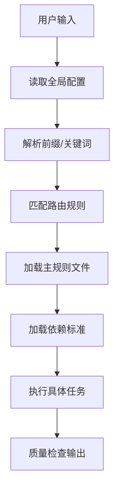
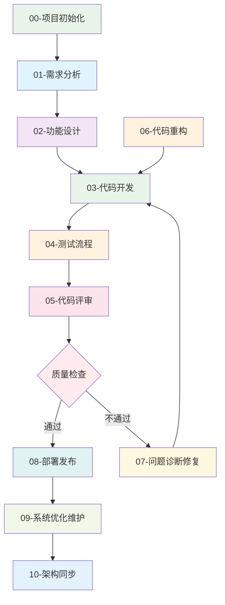

# 🚀 提示词分发系统 v1.0 使用指南

## 📋 系统概览

### 🎯 版本特性
- ✅ **智能分发**：基于前缀和关键词的自动路由
- ✅ **编号体系**：按研发流程的00-10编号系统
- ✅ **模块化设计**：公共标准 + 专项规则的组合架构
- ✅ **质量统一**：一致的质量基线和输出标准
- ✅ **Agent友好**：.md格式，支持Agent直接编辑

### 🏗️ 系统架构

```
提示词分发系统 v2.0
├── 00-global-config.md          # 🌐 全局配置
├── 01-prefix-router.md          # 🎯 智能路由
├── 02-common-standards.md       # 📐 公共标准
├── local*.mdc                   # 🔄 本地定制化的规则不参与推送
└── rules/                       # 📁 规则库
    ├── 00-project-init.md       # 🏆 项目开启：架构设计与初始化
    ├── quality-templates.md     # 📋 质量检查模板 (无序号)
    ├── 01-requirements.md       # 📝 需求分析
    ├── 02-design.md             # 🎨 功能设计
    ├── 03-develop.md            # 💻 代码开发
    ├── 04-testing.md            # 🧪 测试流程
    ├── 05-review.md             # 👀 代码评审
    ├── 06-refactor.md           # 🔧 代码重构
    ├── 07-debug.md              # 🔧 问题诊断修复
    ├── 08-deployment.md         # 🚀 部署发布
    ├── 09-optimization.md       # ⚡ 系统优化维护
    ├── 10-architecture-sync.md  # 🏗️ 架构同步
    └── 11-opensource.md         # 🔍 开源项目完整性检查与创建
```

---

## 🎮 使用方法

### 🤖 Agent执行流程

每次对话开始时，Agent会自动执行以下流程：



### 📍 前缀触发表

| 前缀关键词 | 规则文件 | 执行模式 | 应用场景 |
|------------|----------|----------|----------|
| `项目初始化` `project init` | `00-project-init.md` | 3阶段式 | 项目架构设计与初始化 |
| `需求` `requirements` | `01-requirements.md` | 5步骤化 | 需求分析流程 |
| `design` `设计` | `02-design.md` | 6步骤化 | 功能设计流程 |
| `develop` `开发` | `03-develop.md` | 7步骤化 | 代码开发流程 |
| `test` `测试` | `04-testing.md` | 步骤化 | 测试流程 |
| `review` `评审` | `05-review.md` | 一次性 | 代码评审 |
| `refactor` `重构` | `06-refactor.md` | 步骤化 | 代码重构 |
| `bug` `问题` `debug` | `07-debug.md` | 自适应 | 问题诊断修复 |
| `deploy` `部署` | `08-deployment.md` | 步骤化 | 部署发布 |
| `optimize` `优化` `性能` | `09-optimization.md` | 持续化 | 系统优化维护 |
| `架构` `architecture` | `10-architecture-sync.md` | 步骤化 | 架构同步 |
| `质量` `检查` `模板` | `quality-templates.md` | 参考 | 质量检查模板 |

### 🎯 使用示例

#### 基础使用
```
用户: 需求分析用户登录系统
系统: 📋 执行信息
      - 应用规则：01-requirements.md (需求分析流程)
      - 加载依赖：02-common-standards.md
      - 执行模式：5步骤化执行
      
      开始执行Step 1：需求收集和理解...
```

#### 智能匹配
```
用户: 我想设计一个用户管理功能
系统: 📋 执行信息
      - 应用规则：02-design.md (功能设计流程)
      - 匹配关键词：["设计", "功能"]
      - 执行模式：6步骤化执行
```

#### 问题诊断
```
用户: bug 系统登录失败问题排查
系统: 📋 执行信息
      - 应用规则：07-debug.md (问题诊断修复流程)
      - 执行模式：自适应(根据问题复杂度)
      - 智能分级：P0-P3级别响应
```

#### 组合使用
```
用户: develop 基于设计文档实现登录功能
系统: 📋 执行信息
      - 应用规则：03-develop.md (代码开发流程)
      - 加载依赖：02-common-standards.md, 02-design.md
      - 执行模式：7步骤化执行
```

---

## 📊 质量基线

### 🎯 统一标准
所有规则都遵循统一的质量基线（来自 `02-common-standards.md`）：

- **测试覆盖率**：≥ 90%（核心模块 ≥ 95%）
- **代码复杂度**：≤ 10（建议 ≤ 7）
- **API响应时间**：≤ 500ms（核心接口 ≤ 200ms）
- **系统可用性**：≥ 99.9%
- **安全标准**：生产级安全要求

### 📋 输出规范
每个规则的输出都包含：
- **执行信息**：显示应用的规则和依赖
- **步骤化执行**：清晰的执行步骤和检查点
- **质量检查**：每步的质量验证清单
- **标准模板**：统一的文档输出格式

---

## 🔄 研发流程图



---

## 🛠️ 配置管理

### 📁 文件组织
```
.cursor/rules/
├── 00-global-config.md        # 全局配置和质量基线
├── 01-prefix-router.md        # 路由规则和智能匹配
├── 02-common-standards.md     # 公共标准和规范模板
├── migration-guide.md         # 系统迁移指南
├── README.md                  # 本使用指南
└── rules/                     # 具体规则文件
    ├── 00-project-init.md     # 项目开启：架构设计与初始化
    ├── quality-templates.md   # 质量检查模板库 (无序号模板类)
    ├── 01-requirements.md     # 需求分析：5步流程
    ├── 02-design.md          # 功能设计：6步流程
    ├── 03-develop.md         # 代码开发：7步流程
    ├── 04-testing.md         # 测试流程：测试策略
    ├── 05-review.md          # 代码评审：6维度评审
    ├── 06-refactor.md        # 代码重构：重构流程
    ├── 07-debug.md           # 问题诊断修复：4阶段一体化
    ├── 08-deployment.md      # 部署发布：部署流程
    ├── 09-optimization.md    # 系统优化维护：5维度体系
    ├── 10-architecture-sync.md   # 架构同步：架构维护
    └── 11-opensource.md      # 开源项目完整性检查与创建：4阶段式
```

### 🔧 依赖关系
```yaml
规则依赖图:
  02-common-standards.md:     # 基础标准，被所有规则依赖
    - 质量基线
    - 编码规范
    - 文档模板
    
  quality-templates.md:       # 质量模板库 (无序号模板类)
    depends: [02-common-standards.md]
    
  00-project-init.md:         # 项目开启 (00号规则)
    depends: [quality-templates.md, 02-common-standards.md]
    
  01-requirements.md:         # 需求分析
    depends: [02-common-standards.md]
    
  02-design.md:               # 功能设计
    depends: [02-common-standards.md, quality-templates.md, 10-architecture-sync.md]
    
  03-develop.md:              # 代码开发
    depends: [02-design.md, 02-common-standards.md, quality-templates.md]
```

---

## 🚀 高级特性

### 🎯 智能路由
- **前缀优先**：明确前缀具有最高匹配优先级
- **关键词匹配**：基于内容的智能关键词识别
- **上下文推荐**：根据对话上下文智能推荐规则
- **冲突处理**：自动检测和解决规则冲突

### 📊 质量保证
- **统一基线**：所有规则共享相同的质量标准
- **步骤控制**：严格的步骤化执行控制
- **检查点**：每步都有明确的质量检查要求
- **可追溯性**：完整的执行路径和决策记录

### 🔧 可维护性
- **模块化设计**：清晰的职责分离和依赖关系
- **版本控制**：完整的版本管理和兼容性策略
- **扩展性**：支持新规则的无缝添加
- **监控统计**：规则使用情况的统计和分析

---

## 📚 最佳实践

### 👥 用户使用建议
1. **明确前缀**：在消息开头使用明确的前缀关键词
2. **提供上下文**：给出足够的背景信息帮助智能匹配
3. **步骤确认**：对于步骤化流程，及时给出yes/no确认
4. **质量关注**：关注每步的质量检查清单

### 🤖 Agent执行原则
1. **严格遵循**：必须按照规则要求的格式和步骤执行
2. **依赖加载**：自动加载相关的依赖规则和标准
3. **质量检查**：每步完成后进行质量自检
4. **用户反馈**：及时响应用户的确认和修改要求

### 🔧 系统维护要点
1. **定期更新**：根据使用反馈优化规则内容
2. **统计分析**：跟踪规则使用情况和效果
3. **质量监控**：确保输出质量的持续改进
4. **文档同步**：保持所有文档的及时更新

### 使用方式
1. 为项目添加 git submodule add https://github.com/EvilJoker/prompt.git .cursor

```bash
# ✅ 添加子模块
git submodule add -b branch https://github.com/EvilJoker/prompt.git .cursor

# ✅ 更新指定子模块到远程最新版本
git submodule update --remote .cursor

# ✅ 更新所有子模块到远程最新版本
git submodule update --remote

# ✅ 更新子模块到主仓库记录的版本
git submodule update

# ✅ 初始化并更新所有子模块
git submodule update --init --recursive

# ✅ 更新 进入模块目录，正常推送即可
cd .cursor 
```

---

## 🎯 下一步计划

### 短期目标
- [ ] 完成所有规则文件的创建和测试
- [ ] 验证智能路由的准确性和效率
- [ ] 收集用户反馈并优化使用体验

### 中期目标  
- [ ] 增加更多智能匹配场景
- [ ] 优化规则执行的性能
- [ ] 建立完整的使用统计和分析

### 长期目标
- [ ] 支持自定义规则的动态添加
- [ ] 建立规则效果的自动评估机制
- [ ] 实现基于AI的规则优化建议

🎯 **愿景**：打造最智能、最高效、最易用的AI辅助开发提示词系统！ 