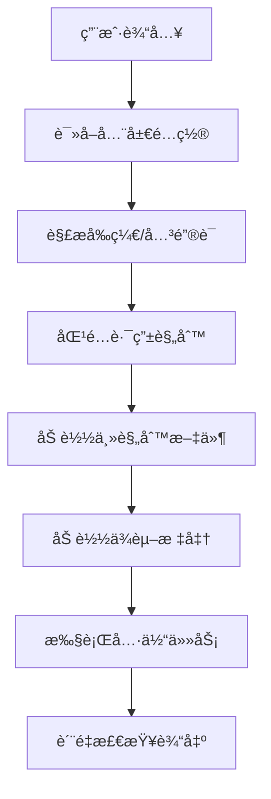
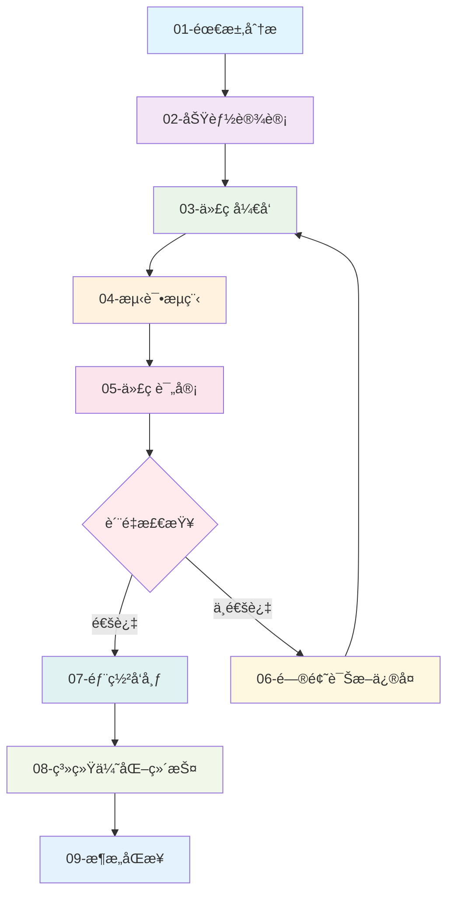

# 🚀 æ示è¯åˆ†å‘系统 v1.0 使用指å—

## 📋 系统概览

### 🯠版本特性
- ✅ **智能分å‘**：基äºå‰ç¼€å’Œå…³é”®è¯çš„自动路由
- ✅ **ç¼–å·ä½“ç³»**：按研å‘æµç¨‹çš„00-09ç¼–å·ç³»ç»Ÿ
- ✅ **模å—化设计**：公共标准 + 专项规则的组åˆæ¶æ„
- ✅ **è´¨é‡ç»Ÿä¸€**：一致的质é‡åŸºçº¿å’Œè¾“出标准
- ✅ **Agentå‹å¥½**：.mdæ ¼å¼ï¼Œæ”¯æŒAgentç›´æ¥ç¼–辑

### ğŸ—ï¸ ç³»ç»Ÿæ¶æ„

```
æ示è¯åˆ†å‘系统 v2.0
├── 00-global-config.md          # 🌠全局é…ç½®
├── 01-prefix-router.mdc         # 🯠智能路由 (ä»…ä¿ç•™.mdc版本)
├── 02-common-standards.md       # 📠公共标准
├── local*.mdc                   # 🔄 本地定制化的规则ä¸å‚ä¸æ¨é€
└── rules/                       # 📠规则库
    ├── 00-project-init.md       # 🆠项目开å¯ï¼šæ¶æ„设计ä¸åˆå§‹åŒ–
    ├── quality-templates.md     # 📋 è´¨é‡æ£€æŸ¥æ¨¡æ¿ (æ— åºå·)
    ├── 02-requirements.md       # 📠需求分æ
    ├── 03-design.md             # 🨠功能设计
    ├── 04-develop.md            # 💻 代ç å¼€å‘
    ├── 05-testing.md            # 🧪 测试æµç¨‹
    ├── 06-review.md             # 👀 代ç è¯„审
    ├── 07-problem-resolution.md # 🔧 问题诊断修å¤
    ├── 08-deployment.md         # 🚀 部署å‘布
    ├── 09-system-optimization.md # ⚡ 系统优化维护
    └── 10-architecture-sync.md  # ğŸ—ï¸ æ¶æ„åŒæ­¥
```

---

## 🮠使用方法

### 🤖 Agent执行æµç¨‹

æ¯æ¬¡å¯¹è¯å¼€å§‹æ—¶ï¼ŒAgent会自动执行以下æµç¨‹ï¼š


```mermaid
graph TD
    A[用户输入] --> B[读å–全局é…ç½®]
    B --> C[解æå‰ç¼€/关键è¯]
    C --> D[匹é…路由规则]
    D --> E[加载主规则文件]
    E --> F[加载ä¾èµ–标准]
    F --> G[执行具体任务]
    G --> H[è´¨é‡æ£€æŸ¥è¾“出]
```

### 📠å‰ç¼€è§¦å‘表

| å‰ç¼€å…³é”®è¯ | 规则文件 | æ‰§è¡Œæ¨¡å¼ | 应用场景 |
|------------|----------|----------|----------|
| `项目åˆå§‹åŒ–` `project init` | `00-project-init.md` | 3é˜¶æ®µå¼ | 项目æ¶æ„设计ä¸åˆå§‹åŒ– |
| `需求` `requirements` | `02-requirements.md` | 5步骤化 | 需求分ææµç¨‹ |
| `design` `设计` | `03-design.md` | 7步骤化 | 功能设计æµç¨‹ |
| `dev` `å¼€å‘` | `04-develop.md` | 5步骤化 | 代ç å¼€å‘æµç¨‹ |
| `test` `测试` | `05-testing.md` | 步骤化 | 测试æµç¨‹ |
| `review` `评审` | `06-review.md` | 一次性 | 代ç è¯„审 |
| `bug` `问题` `debug` | `07-problem-resolution.md` | 自适应 | é—®é¢˜è¯Šæ–­ä¿®å¤ |
| `deploy` `部署` | `08-deployment.md` | 步骤化 | 部署å‘布 |
| `维护` `optimize` `性能` | `09-system-optimization.md` | æŒç»­åŒ– | 系统优化维护 |
| `æ¶æ„` `architecture` | `10-architecture-sync.md` | 步骤化 | æ¶æ„åŒæ­¥ |
| `è´¨é‡` `检查` `模æ¿` | `quality-templates.md` | å‚考 | è´¨é‡æ£€æŸ¥æ¨¡æ¿ |

### 🯠使用示例

#### 基础使用
```
用户: 需求分æ用户登录系统
系统: 📋 执行信æ¯
      - 应用规则：01-requirements.md (需求分ææµç¨‹)
      - 加载ä¾èµ–：02-common-standards.md
      - 执行模å¼ï¼š5步骤化执行
      
      开始执行Step 1：需求收集和ç†è§£...
```

#### 智能匹é…
```
用户: 我想设计一个用户管ç†åŠŸèƒ½
系统: 📋 执行信æ¯
      - 应用规则：02-design.md (功能设计æµç¨‹)
      - 匹é…关键è¯ï¼š["设计", "功能"]
      - 执行模å¼ï¼š7步骤化执行
```

#### 问题诊断
```
用户: bug 系统登录失败问题æ’查
系统: 📋 执行信æ¯
      - 应用规则：06-problem-resolution.md (问题诊断修å¤æµç¨‹)
      - 执行模å¼ï¼šè‡ªé€‚应(æ ¹æ®é—®é¢˜å¤æ‚度)
      - 智能分级：P0-P3级别å“应
```

#### 组åˆä½¿ç”¨
```
用户: dev 基äºè®¾è®¡æ–‡æ¡£å®ç°ç™»å½•åŠŸèƒ½
系统: 📋 执行信æ¯
      - 应用规则：03-develop.md (代ç å¼€å‘æµç¨‹)
      - 加载ä¾èµ–：02-common-standards.md, 02-design.md
      - 执行模å¼ï¼š5步骤化执行
```

---

## 📊 è´¨é‡åŸºçº¿

### 🯠统一标准
所有规则都éµå¾ªç»Ÿä¸€çš„è´¨é‡åŸºçº¿ï¼ˆæ¥è‡ª `02-common-standards.md`）：

- **测试覆盖ç‡**：≥ 90%ï¼ˆæ ¸å¿ƒæ¨¡å— â‰¥ 95%）
- **代ç å¤æ‚度**：≤ 10（建议 ≤ 7）
- **APIå“应时间**：≤ 500ms（核心æ¥å£ ≤ 200ms）
- **系统å¯ç”¨æ€§**：≥ 99.9%
- **安全标准**：生产级安全è¦æ±‚

### 📋 输出规范
æ¯ä¸ªè§„则的输出都包å«ï¼š
- **执行信æ¯**：显示应用的规则和ä¾èµ–
- **步骤化执行**：清晰的执行步骤和检查点
- **è´¨é‡æ£€æŸ¥**：æ¯æ­¥çš„è´¨é‡éªŒè¯æ¸…å•
- **标准模æ¿**：统一的文档输出格å¼

---

## 🔄 ç ”å‘æµç¨‹å›¾


```mermaid
graph TD
    A[01-需求分æ] --> B[02-功能设计]
    B --> C[03-代ç å¼€å‘]
    C --> D[04-测试æµç¨‹]
    D --> E[05-代ç è¯„审]
    E --> F{è´¨é‡æ£€æŸ¥}
    F -->|通过| G[07-部署å‘布]
    F -->|ä¸é€šè¿‡| H[06-问题诊断修å¤]
    H --> C
    G --> I[08-系统优化维护]
    I --> J[09-æ¶æ„åŒæ­¥]
    
    style A fill:#e1f5fe
    style B fill:#f3e5f5
    style C fill:#e8f5e8
    style D fill:#fff3e0
    style E fill:#fce4ec
    style F fill:#ffebee
    style G fill:#e0f2f1
    style H fill:#fff8e1
    style I fill:#f1f8e9
    style J fill:#e3f2fd
```

---

## ğŸ› ï¸ é…置管ç†

### 📠文件组织
```
.cursor/rules/
├── 00-global-config.md        # 全局é…置和质é‡åŸºçº¿
├── 01-prefix-router.mdc       # è·¯ç”±è§„åˆ™å’Œæ™ºèƒ½åŒ¹é… (ä»….mdc版本)
├── 02-common-standards.md     # 公共标准和规范模æ¿
├── migration-guide.md         # 系统è¿ç§»æŒ‡å—
├── README.md                  # 本使用指å—
└── rules/                     # 具体规则文件
    ├── 00-project-init.md     # 项目开å¯ï¼šæ¶æ„设计ä¸åˆå§‹åŒ–
    ├── quality-templates.md   # è´¨é‡æ£€æŸ¥æ¨¡æ¿åº“ (æ— åºå·æ¨¡æ¿ç±»)
    ├── 02-requirements.md     # 需求分æ：5æ­¥æµç¨‹
    ├── 03-design.md          # 功能设计：7æ­¥æµç¨‹
    ├── 04-develop.md         # 代ç å¼€å‘：5æ­¥æµç¨‹
    ├── 05-testing.md         # 测试æµç¨‹ï¼šæµ‹è¯•ç­–ç•¥
    ├── 06-review.md          # 代ç è¯„审：6维度评审
    ├── 07-problem-resolution.md # 问题诊断修å¤ï¼š4阶段一体化
    ├── 08-deployment.md      # 部署å‘布：部署æµç¨‹
    ├── 09-system-optimization.md # 系统优化维护：5维度体系
    └── 10-architecture-sync.md   # æ¶æ„åŒæ­¥ï¼šæ¶æ„维护
```

### 🔧 ä¾èµ–关系
```yaml
规则ä¾èµ–图:
  02-common-standards.md:     # 基础标准，被所有规则ä¾èµ–
    - è´¨é‡åŸºçº¿
    - ç¼–ç è§„范
    - 文档模æ¿
    
  quality-templates.md:       # è´¨é‡æ¨¡æ¿åº“ (æ— åºå·æ¨¡æ¿ç±»)
    depends: [02-common-standards.md]
    
  00-project-init.md:         # é¡¹ç›®å¼€å¯ (00å·è§„则)
    depends: [quality-templates.md, 02-common-standards.md]
    
  02-requirements.md:         # 需求分æ
    depends: [02-common-standards.md]
    
  03-design.md:              # 功能设计
    depends: [02-common-standards.md, 02-requirements.md]
    
  04-develop.md:             # 代ç å¼€å‘
    depends: [02-common-standards.md, 03-design.md]
    
  05-testing.md:             # 测试æµç¨‹
    depends: [02-common-standards.md, 04-develop.md]
    
  06-review.md:              # 代ç è¯„审
    depends: [02-common-standards.md, 04-develop.md]
    
  07-problem-resolution.md:  # 问题诊断修å¤
    depends: [02-common-standards.md, 05-testing.md, 06-review.md]
    
  08-deployment.md:          # 部署å‘布
    depends: [02-common-standards.md, 05-testing.md]
    
  09-system-optimization.md: # 系统优化维护
    depends: [02-common-standards.md, 08-deployment.md]
    
  10-architecture-sync.md:   # æ¶æ„åŒæ­¥
    depends: [02-common-standards.md, 03-design.md, 04-develop.md]
```

---

## 🚀 高级特性

### 🯠智能路由
- **å‰ç¼€ä¼˜å…ˆ**：æ˜ç¡®å‰ç¼€å…·æœ‰æœ€é«˜åŒ¹é…优先级
- **关键è¯åŒ¹é…**：基äºå†…容的智能关键è¯è¯†åˆ«
- **上下文æ¨è**：根æ®å¯¹è¯ä¸Šä¸‹æ–‡æ™ºèƒ½æ¨è规则
- **冲çªå¤„ç†**：自动检测和解决规则冲çª

### 📊 è´¨é‡ä¿è¯
- **统一基线**：所有规则共享相åŒçš„è´¨é‡æ ‡å‡†
- **步骤æ§åˆ¶**：严格的步骤化执行æ§åˆ¶
- **检查点**：æ¯æ­¥éƒ½æœ‰æ˜ç¡®çš„è´¨é‡æ£€æŸ¥è¦æ±‚
- **å¯è¿½æº¯æ€§**：完整的执行路径和决策记录

### 🔧 å¯ç»´æŠ¤æ€§
- **模å—化设计**：清晰的èŒè´£åˆ†ç¦»å’Œä¾èµ–关系
- **版本æ§åˆ¶**：完整的版本管ç†å’Œå…¼å®¹æ€§ç­–ç•¥
- **扩展性**：支æŒæ–°è§„则的无ç¼æ·»åŠ 
- **监æ§ç»Ÿè®¡**：规则使用情况的统计和分æ

---

## 📚 最佳å®è·µ

### 👥 用户使用建议
1. **æ˜ç¡®å‰ç¼€**：在消æ¯å¼€å¤´ä½¿ç”¨æ˜ç¡®çš„å‰ç¼€å…³é”®è¯
2. **æ供上下文**：给出足够的背景信æ¯å¸®åŠ©æ™ºèƒ½åŒ¹é…
3. **步骤确认**：对äºæ­¥éª¤åŒ–æµç¨‹ï¼ŒåŠæ—¶ç»™å‡ºyes/no确认
4. **è´¨é‡å…³æ³¨**：关注æ¯æ­¥çš„è´¨é‡æ£€æŸ¥æ¸…å•

### 🤖 Agent执行åŸåˆ™
1. **严格éµå¾ª**：必须按照规则è¦æ±‚çš„æ ¼å¼å’Œæ­¥éª¤æ‰§è¡Œ
2. **ä¾èµ–加载**：自动加载相关的ä¾èµ–规则和标准
3. **è´¨é‡æ£€æŸ¥**：æ¯æ­¥å®Œæˆå进行质é‡è‡ªæ£€
4. **用户å馈**：åŠæ—¶å“应用户的确认和修改è¦æ±‚

### 🔧 系统维护è¦ç‚¹
1. **定期更新**：根æ®ä½¿ç”¨å馈优化规则内容
2. **统计分æ**：跟踪规则使用情况和效æœ
3. **è´¨é‡ç›‘æ§**：确ä¿è¾“出质é‡çš„æŒç»­æ”¹è¿›
4. **文档åŒæ­¥**：ä¿æŒæ‰€æœ‰æ–‡æ¡£çš„åŠæ—¶æ›´æ–°

### 使用方å¼
1. 为项目添加 git submodule add https://github.com/EvilJoker/prompt.git .cursor


```bash
# ✅ 添加å­æ¨¡å—
git submodule add -b branch https://github.com/EvilJoker/prompt.git .cursor

# ✅ 更新指定å­æ¨¡å—到远程最新版本
git submodule update --remote .cursor

# ✅ 更新所有å­æ¨¡å—到远程最新版本
git submodule update --remote

# ✅ æ›´æ–°å­æ¨¡å—到主仓库记录的版本
git submodule update

# ✅ åˆå§‹åŒ–并更新所有å­æ¨¡å—
git submodule update --init --recursive

# ✅ æ›´æ–° 进入模å—目录，正常æ¨é€å³å¯
cd .cursor 

```

---

## 🯠下一步计划

### 短期目标
- [ ] 完æˆæ‰€æœ‰10个规则文件的创建和测试
- [ ] 验è¯æ™ºèƒ½è·¯ç”±çš„准确性和效ç‡
- [ ] 收集用户å馈并优化使用体验

### 中期目标  
- [ ] å¢åŠ æ›´å¤šæ™ºèƒ½åŒ¹é…场景
- [ ] 优化规则执行的性能
- [ ] 建立完整的使用统计和分æ

### 长期目标
- [ ] 支æŒè‡ªå®šä¹‰è§„则的动æ€æ·»åŠ 
- [ ] 建立规则效æœçš„自动评估机制
- [ ] å®ç°åŸºäºAI的规则优化建议

🯠**愿景**：打造最智能ã€æœ€é«˜æ•ˆã€æœ€æ˜“用的AI辅助开å‘æ示è¯ç³»ç»Ÿï¼ 